# 学生管理系统

基于 Spring Boot 单体架构的学生管理系统通用骨架版，适用于课程设计和结课大作业。项目保持通用骨架结构，方便二次开发或个人化定制。

## 系统截图

### 登录页面
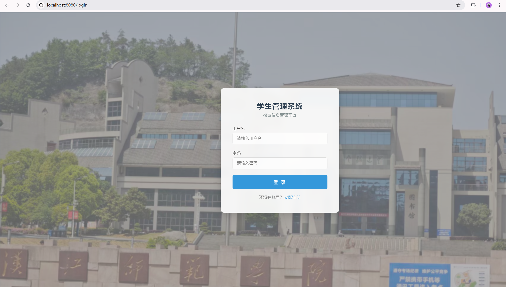
### 管理员首页
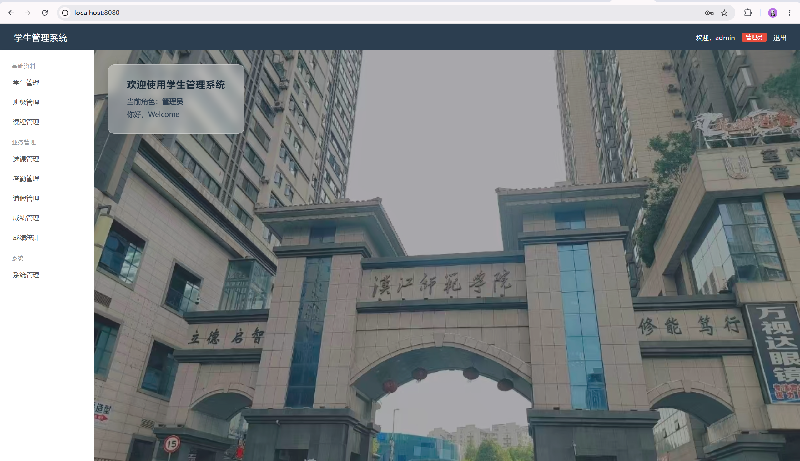
### 学生管理
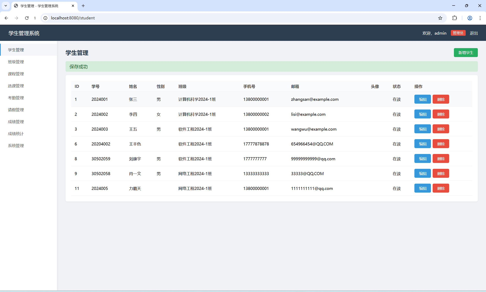
### 班级管理
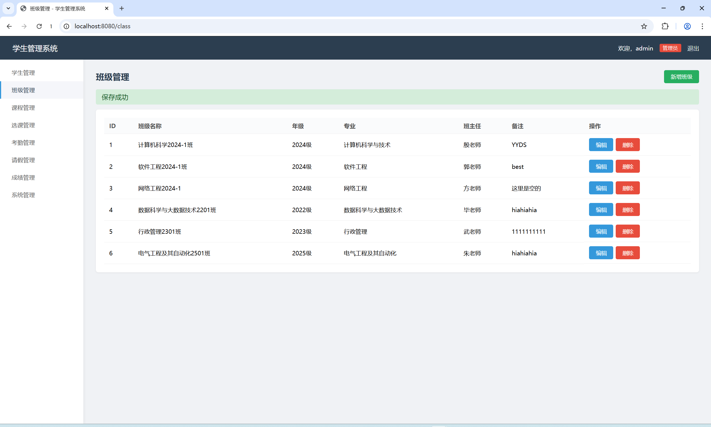
### 课程管理
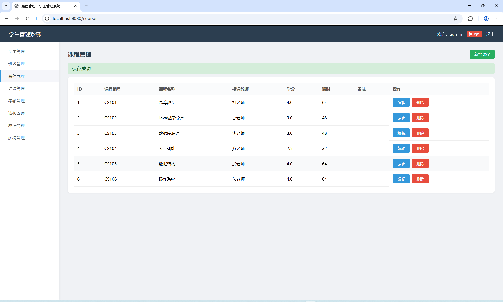
### 选课管理
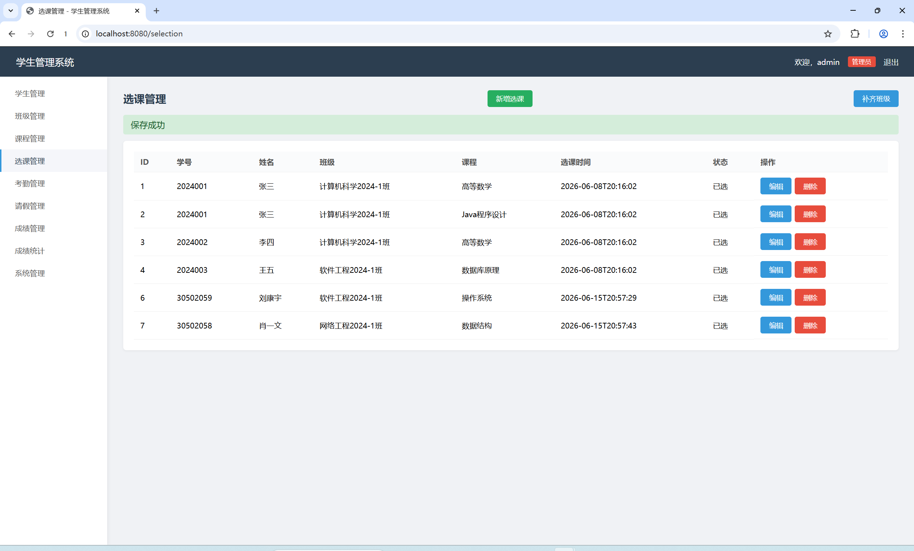
### 考勤管理
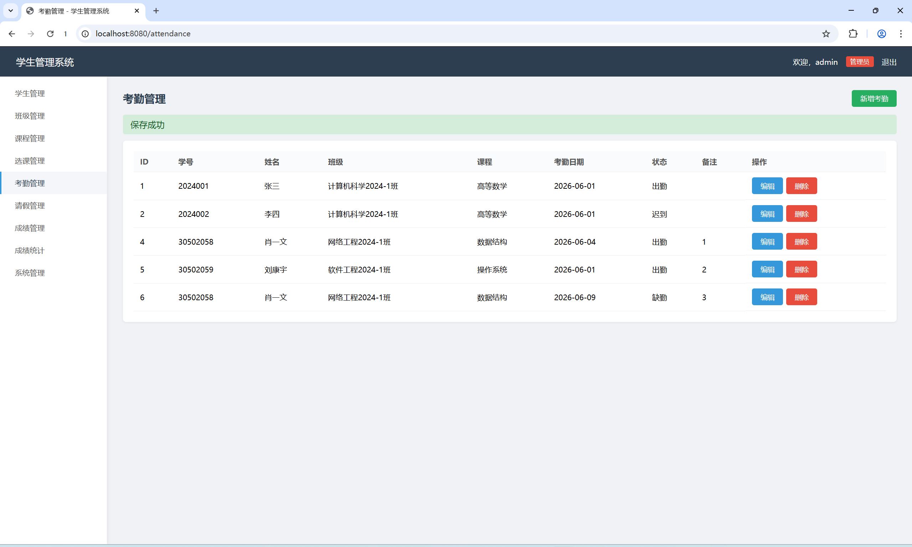
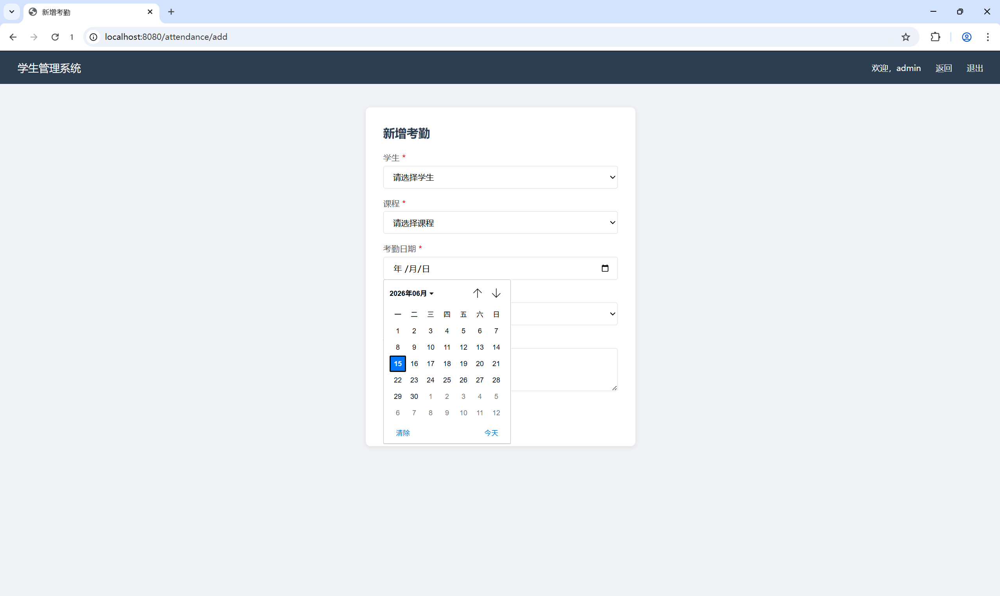
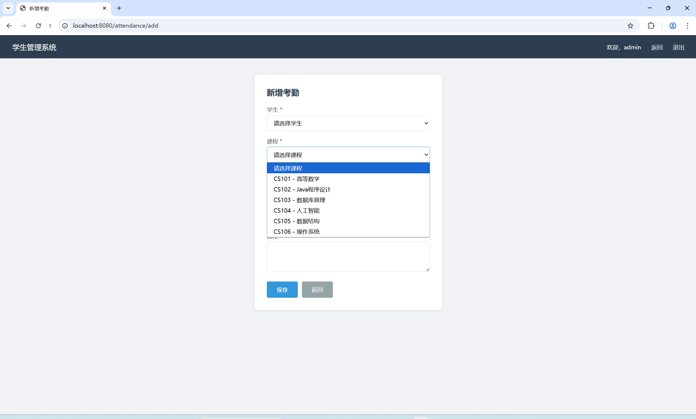
### 请假管理
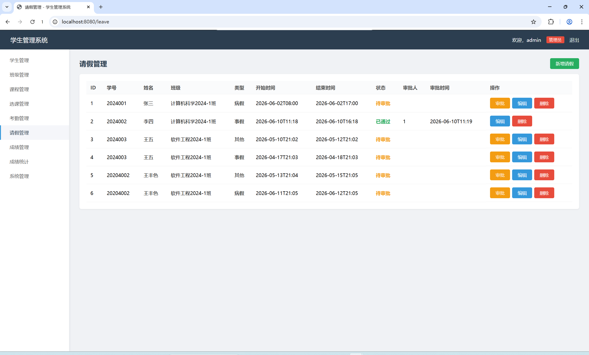
### 成绩管理
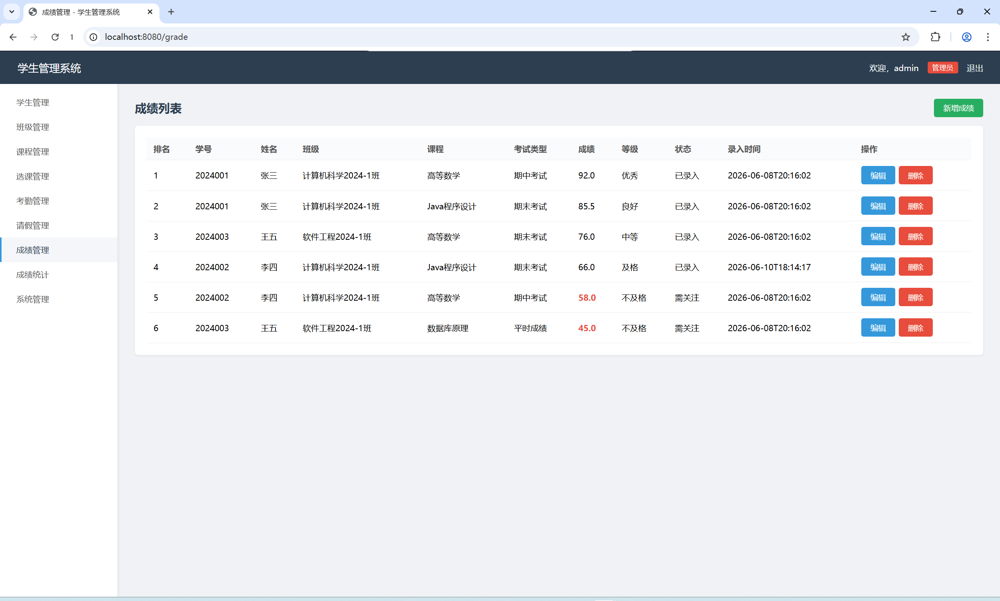
### 成绩统计
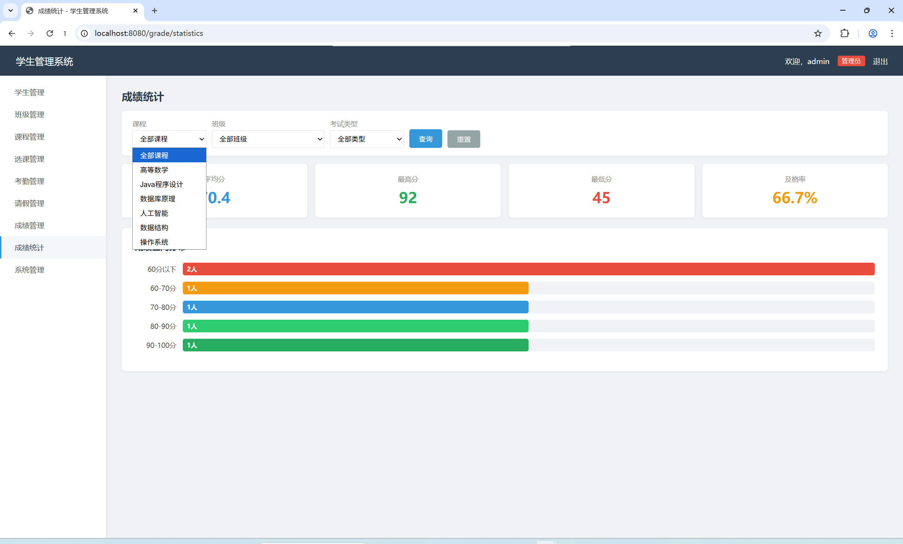
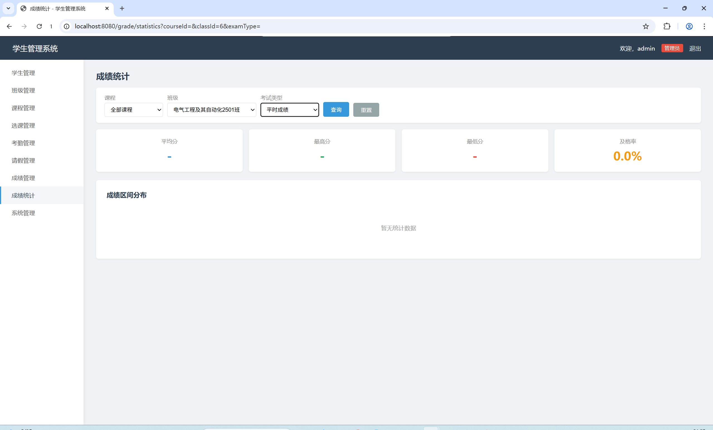
### 系统管理
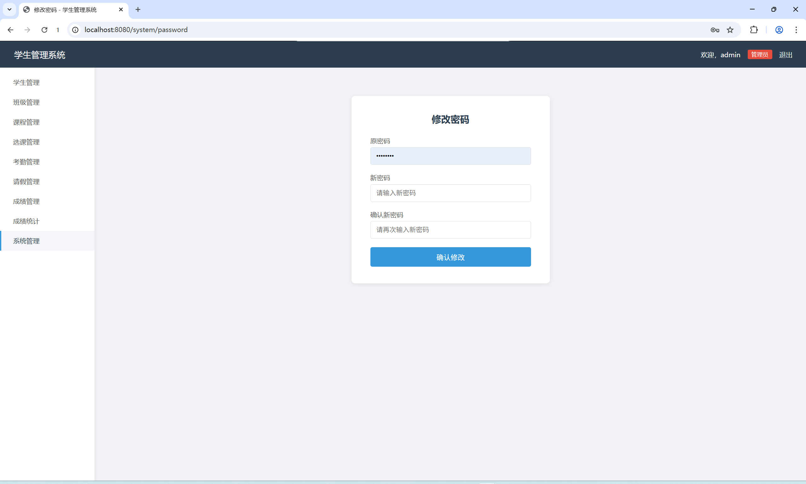

## 技术栈

- Java 8
- Spring Boot 2.7.18
- Maven
- MySQL 5.7+
- Thymeleaf

## 功能模块

| 模块 | 管理员 | 学生 |
|------|--------|------|
| 登录 / 注册 / 退出 | ✅ 登录退出 | ✅ 登录注册退出 |
| 学生信息管理 | CRUD + 编辑全部字段 | 查看自己 + 修改头像 |
| 班级信息管理 | CRUD | 浏览 |
| 课程信息管理 | CRUD | 浏览 |
| 选课信息管理 | CRUD | 选课 / 取消 / 查看自己的选课 |
| 考勤信息管理 | CRUD | 查看自己的考勤 |
| 请假信息管理 | CRUD + 审批 | 申请 / 查看自己的请假 |
| 成绩信息管理 | CRUD（成绩列表） | 查看自己的成绩 |
| 成绩统计 | 筛选 + 统计卡片 + 柱状图 | ❌ |
| 修改密码 | ✅ | ✅ |

## 角色权限

- **学生**：可注册，注册后默认角色为学生。只能查看/操作自己的数据。
- **管理员**：由数据库初始化 SQL 插入，不开放管理员注册。拥有全部模块的增删改查权限，可以审批请假。
- 管理员账号同时代表教师角色。

## 数据库

### 环境要求

- MySQL 5.7 或更高版本
- Navicat 或其他 MySQL 客户端

### 数据库初始化

1. 在 Navicat 中选择你的本机 MySQL 连接，新建数据库：
   - 数据库名：`student_management`
   - 字符集：`utf8mb4`
   - 排序规则：`utf8mb4_general_ci`
2. 打开新建的数据库，新建查询
3. 将 `src/main/resources/schema.sql` 的全部内容粘贴到查询窗口，执行

> ⚠️ `schema.sql` 适合首次初始化。如果重复执行，可能会因用户名、学号、课程编号、选课记录、成绩记录等唯一约束报错。重复执行前请先删除数据库或清空相关数据。

### 数据库表

| 表名 | 说明 |
|------|------|
| `user_account` | 用户账号表 |
| `student_info` | 学生信息表 |
| `class_info` | 班级信息表 |
| `course_info` | 课程信息表 |
| `course_selection` | 选课信息表 |
| `attendance_info` | 考勤信息表 |
| `leave_info` | 请假信息表 |
| `grade_info` | 成绩信息表 |

## 运行步骤

### 1. 配置数据库连接

编辑 `src/main/resources/application.yml`，将 `username` 和 `password` 改为你的 MySQL 账号密码：

```yaml
spring:
  datasource:
    username: root            # 改为你的 MySQL 用户名
    password: your_password   # 改为你的 MySQL 密码
```

### 2. 启动项目

在项目根目录打开 PowerShell，执行：

```powershell
.\mvnw.cmd spring-boot:run
```

### 3. 访问系统

浏览器打开：http://localhost:8080

### 默认账号

| 角色 | 用户名 | 密码 | 说明 |
|------|--------|------|------|
| 管理员 | `admin` | `admin123` | 数据库初始化插入 |
| 学生 | `zhangsan` | `123456` | 测试数据，也可自行注册 |

> ⚠️ 以上默认密码仅用于本地实验演示，不要用于生产环境。

## 项目结构

```
src/main/java/com/example/student/
├── StudentManagementApplication.java
├── config/
│   └── WebConfig.java                 # 拦截器配置
├── interceptor/
│   └── LoginInterceptor.java          # 登录拦截器
├── entity/
│   ├── UserAccount.java               # 用户账号
│   ├── StudentInfo.java               # 学生信息
│   ├── ClassInfo.java                 # 班级信息
│   ├── CourseInfo.java                # 课程信息
│   ├── CourseSelection.java           # 选课信息
│   ├── AttendanceInfo.java            # 考勤信息
│   ├── LeaveInfo.java                 # 请假信息
│   └── GradeInfo.java                 # 成绩信息
├── repository/
│   ├── UserAccountRepository.java
│   ├── StudentInfoRepository.java
│   ├── ClassInfoRepository.java
│   ├── CourseInfoRepository.java
│   ├── CourseSelectionRepository.java
│   ├── AttendanceInfoRepository.java
│   ├── LeaveInfoRepository.java
│   └── GradeInfoRepository.java
├── service/
│   ├── UserService.java
│   ├── StudentService.java
│   ├── ClassService.java
│   ├── CourseService.java
│   ├── CourseSelectionService.java
│   ├── AttendanceService.java
│   ├── LeaveService.java
│   └── GradeService.java
└── controller/
    ├── AuthController.java            # 登录/注册/退出
    ├── StudentController.java         # 学生管理
    ├── ClassController.java           # 班级管理
    ├── CourseController.java          # 课程管理
    ├── CourseSelectionController.java # 选课管理
    ├── AttendanceController.java      # 考勤管理
    ├── LeaveController.java           # 请假管理
    ├── GradeController.java           # 成绩管理+统计
    └── SystemController.java          # 修改密码

src/main/resources/
├── application.yml
├── schema.sql                         # 建库建表+测试数据
├── templates/
│   ├── login.html
│   ├── register.html
│   ├── index.html
│   ├── class/
│   ├── course/
│   ├── student/
│   ├── selection/
│   ├── attendance/
│   ├── leave/
│   ├── grade/
│   └── system/
└── static/
    ├── css/
    ├── js/
    └── images/
```

## 开发阶段

| 阶段 | 内容 | 状态 |
|------|------|------|
| 第一阶段 | 基础骨架 + 登录注册 + 角色区分 | ✅ |
| 第二阶段 | 基础资料管理（学生/班级/课程） | ✅ |
| 第三阶段 | 选课信息管理 | ✅ |
| 第四阶段 | 考勤/请假/成绩管理 | ✅ |
| 第五阶段 | 系统管理 + README + 发布 | ✅ |

## 个性化定制与问题修复

以下为通用骨架版基础上进行的界面定制和 Bug 修复总结。

### 界面定制

- **登录页**：使用全屏校园背景图（`/images/login-bg.jpg`），CSS 伪元素叠加半透明遮罩保证登录框可读，登录卡片采用半透明白色圆角设计。
- **首页**：右侧主内容区使用独立背景图（`/images/1.jpg`），顶部导航栏和左侧菜单栏保持后台管理系统布局不变，欢迎卡片采用毛玻璃效果（`backdrop-filter: blur` + 半透明背景），文字保持完全不透明。
- **静态资源放行**：`WebConfig` 拦截器排除 `/images/**`、`/css/**`、`/js/**` 等静态路径，避免未登录时背景图被拦截重定向。

### Bug 修复

#### 学生编辑时学号重复校验失效

**问题**：编辑学生时将学号改为其他已存在的学号，系统未提示重复并直接保存。

**原因**：Controller 中 `excludeId` 逻辑依赖表单提交的 `id` 值，未从数据库加载原记录进行比对，边界情况下走入了新增分支的查重逻辑。

**修复**：编辑时先通过 `findById` 从数据库读取原学生记录；若学号未变化则跳过查重直接保存；若学号改变则调用 `isStudentNoDuplicate(newNo, currentDbId)`，仅依据 `student_info.student_no` 列判断是否被其他学生占用。

如需检查数据库中已存在的学号重复数据，可执行：

```sql
SELECT student_no, COUNT(*) FROM student_info GROUP BY student_no HAVING COUNT(*) > 1;
```

**涉及文件**：`StudentController.java`、`StudentService.java`、`student/form.html`

### 注意事项

- 本项目为二次开发版，含学校名称、logo、介绍文字等定制内容。
- 密码采用明文存储，仅适合课程实验演示，不要用于生产环境。
- `.gitignore` 应忽略 `target/`、`.idea/`、`*.iml` 等文件。