# 学生管理系统（Spring Boot 单体架构）

基于 **Spring Boot 2.7.18 + Java 8 + MySQL + Thymeleaf** 的学生管理系统，适用于课程设计、结课大作业和个人二次开发。系统采用单体架构和 MVC 分层模式，围绕学生、班级、课程、选课、考勤、请假、成绩等教学管理场景进行设计，实现管理员端与学生端两类角色的基本业务闭环。

> 当前仓库为 personalized 版本，在通用骨架基础上补充了查询筛选、分页、批量删除、学生端数据查看等功能，并配套更新了运行截图。

## 一、项目特点

- **单体架构清晰**：一个 Spring Boot 应用完成全部业务模块，部署和调试简单。
- **MVC 分层明确**：Controller 负责请求与权限校验，Service 负责业务逻辑，Repository 负责数据访问。
- **两类角色**：管理员和学生，使用 `HttpSession` 保存登录状态与角色信息。
- **服务端渲染**：使用 Thymeleaf 模板渲染页面，不依赖 Vue、React 等前端框架。
- **查询筛选与分页**：主要列表页支持条件查询、下拉筛选和每页 10 条分页。
- **管理员批量删除**：管理员端主要数据列表支持当前页多选和批量删除。
- **成绩自动计算**：根据成绩分数自动计算等级和状态。
- **课程设计友好**：技术栈适中，结构清楚，适合答辩展示和二次扩展。

## 二、技术栈

| 类型 | 技术 |
|------|------|
| 开发语言 | Java 8 |
| 后端框架 | Spring Boot 2.7.18 |
| 构建工具 | Maven Wrapper |
| 数据库 | MySQL |
| 数据访问 | Spring Data JPA / Hibernate |
| 模板引擎 | Thymeleaf |
| 前端样式 | HTML + CSS + 原生 JavaScript |
| 权限控制 | HttpSession + Controller 层角色校验 |

## 三、功能模块

| 模块 | 管理员端 | 学生端 |
|------|----------|--------|
| 登录 / 注册 / 退出 | 管理员登录、退出 | 学生注册、登录、退出 |
| 学生管理 | 新增、编辑、删除、查询、分页、批量删除 | 查看本人信息 |
| 班级管理 | 新增、编辑、删除、班级名称查询、专业筛选、分页、批量删除 | 浏览班级、查询、筛选、分页 |
| 课程管理 | 新增、编辑、删除、课程名称查询、课程编号筛选、分页、批量删除 | 浏览课程、查询、筛选、分页 |
| 选课管理 | 新增、编辑、删除、姓名查询、课程筛选、分页、批量删除、补齐班级 | 查看可选课程、选课、取消选课、我的选课查询与分页 |
| 考勤管理 | 新增、编辑、删除、学号查询、学生筛选、分页、批量删除 | 查看本人考勤、课程查询、课程筛选、分页 |
| 请假管理 | 新增、编辑、删除、审批、请假类型查询、状态筛选、分页、批量删除 | 提交请假申请、查看审批结果、请假类型查询、状态筛选、分页 |
| 成绩管理 | 新增、编辑、删除、课程名称查询、考试类型筛选、分页、批量删除 | 查看本人成绩、课程名称查询、考试类型筛选、分页 |
| 成绩统计 | 按课程、班级、考试类型统计平均分、最高分、最低分、及格率和区间分布 | 无 |
| 系统管理 | 修改密码 | 修改密码 |

## 四、系统截图

### 1. 学生端浏览班级

学生登录后可浏览班级信息，支持班级名称模糊查询、专业下拉筛选和分页展示。

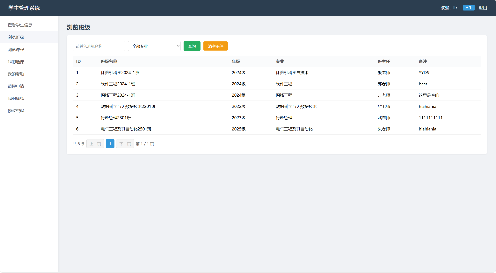

### 2. 学生端班级筛选

班级筛选条件来自数据库已有专业数据，选择专业后只展示对应专业班级。

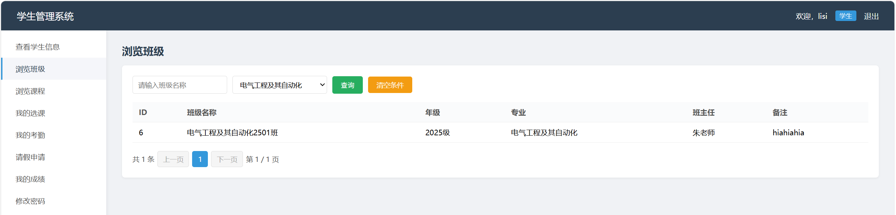

### 3. 学生端浏览课程

学生可浏览课程列表，支持课程名称查询、课程编号筛选和分页。

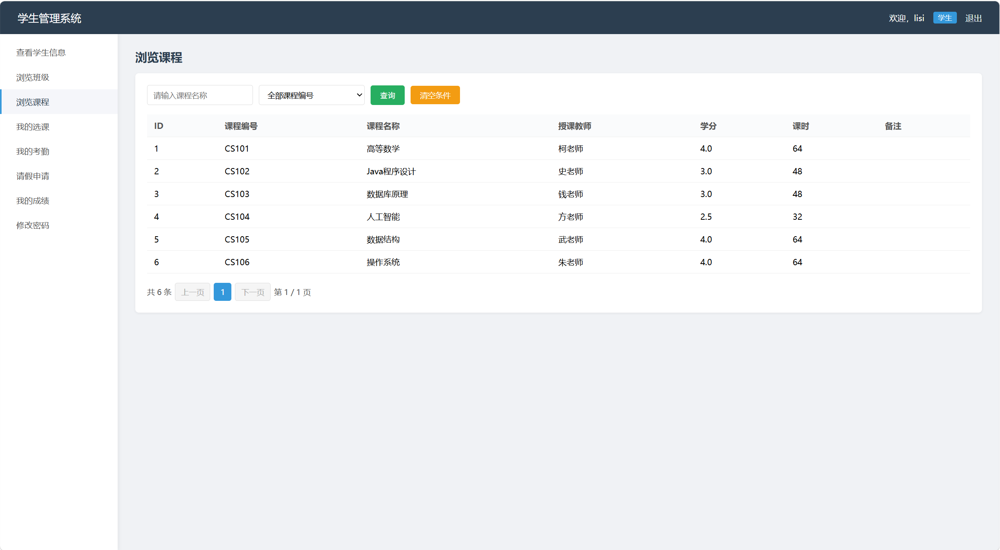

### 4. 学生端我的选课

学生端“我的选课”包含可选课程和我的选课记录两个区块，可对本人选课记录按课程名称和课程下拉条件查询，并支持分页。

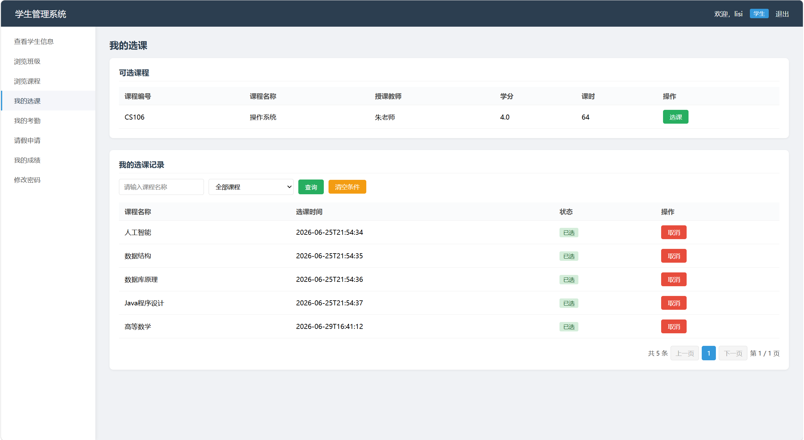

### 5. 学生端我的请假

学生可查看自己的请假记录，支持请假类型模糊查询、审批状态筛选和分页。

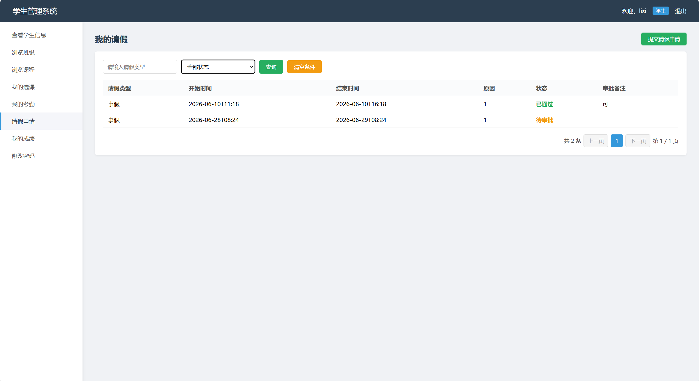

### 6. 学生端提交请假申请

学生可提交请假申请，填写请假类型、原因、开始时间、结束时间和备注，提交后进入待审批状态。

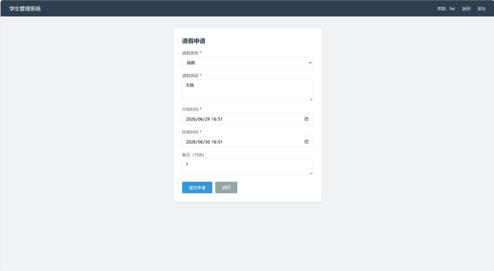

### 7. 请假申请提交结果

提交成功后，系统在“我的请假”页面显示提示信息，并展示新增的待审批记录。

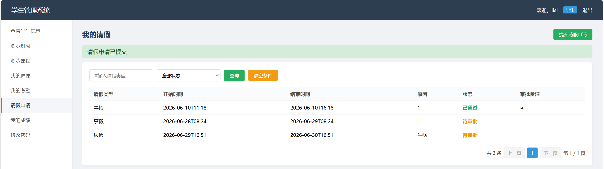

### 8. 学生端我的成绩

学生只能查看自己的成绩记录，可按课程名称和考试类型进行组合查询，成绩低于 60 分时突出显示并标记为需关注。

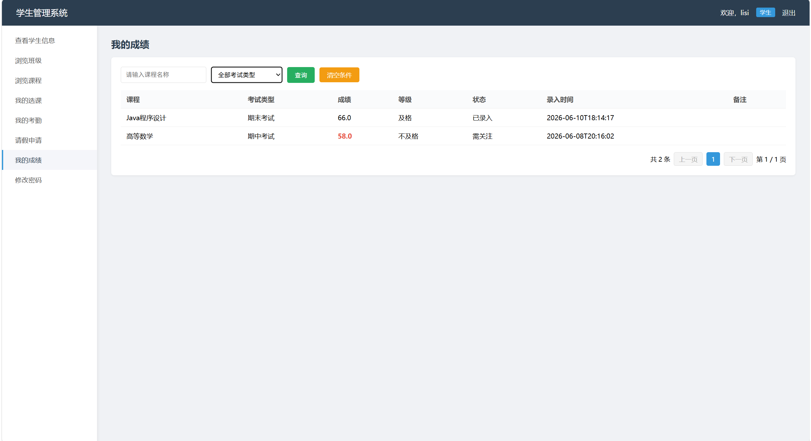

### 9. 管理员端学生管理

管理员端学生管理支持姓名查询、班级筛选、分页、单条编辑删除和当前页多选批量删除。

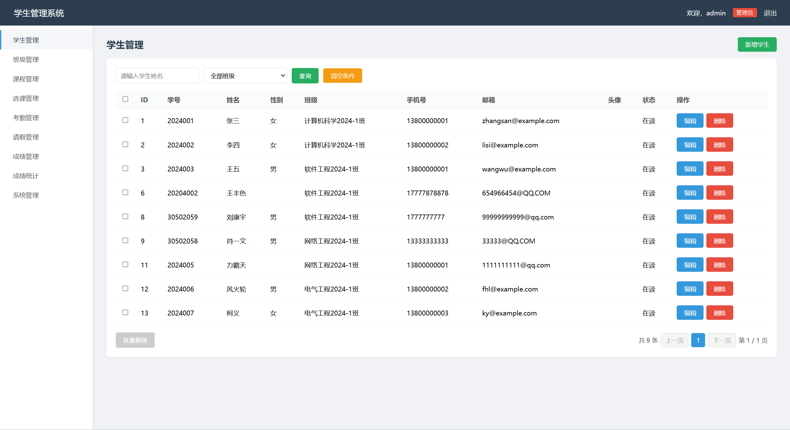

### 10. 管理员端请假管理

管理员可查看全部请假记录，按请假类型和审批状态筛选，对待审批记录进行审批，也可进行编辑、删除和批量删除。

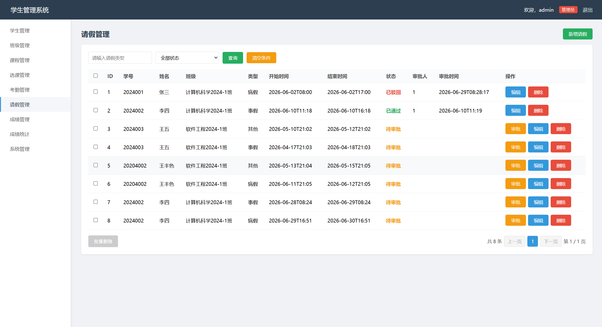

### 11. 管理员端成绩统计

成绩统计页面支持按课程、班级、考试类型筛选，展示平均分、最高分、最低分、及格率和成绩区间分布。

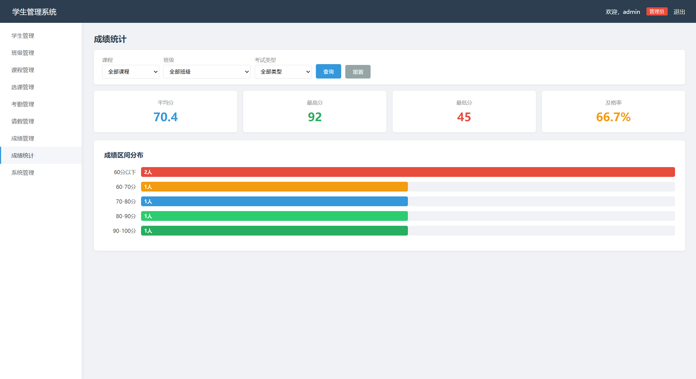

## 五、角色权限说明

### 管理员

管理员账号由初始化 SQL 插入，不开放管理员注册。管理员拥有学生、班级、课程、选课、考勤、请假、成绩等模块的管理权限，可进行新增、编辑、删除、查询筛选、分页和批量删除操作，并可审批学生请假申请。

### 学生

学生可自行注册账号，注册后默认角色为学生。学生只能查看和操作与自己相关的数据，例如本人的选课、考勤、请假、成绩等，不能访问管理员端写操作接口。

## 六、核心业务说明

### 1. 登录与权限控制

系统使用 `HttpSession` 保存登录状态、用户名、角色和关联学生 ID。登录成功后，根据角色进入不同菜单。所有新增、编辑、删除、批量删除等写操作均在 Controller 层进行角色校验，避免仅依赖前端隐藏按钮实现权限控制。

### 2. 查询筛选与分页

管理员端和学生端主要列表页统一采用后端分页方式：

- 每页固定 10 条；
- 页面页码从 1 开始；
- Controller 内部转换为 Spring Data JPA 的 0 基页码；
- 查询条件翻页后保持；
- 当前页越界时自动修正到有效页；
- 无数据时显示对应“暂无数据”提示。

### 3. 管理员端批量删除

管理员端学生、班级、课程、选课、考勤、请假、成绩列表均支持当前页多选批量删除：

- 表头复选框只控制当前页可见记录；
- 未选择记录时按钮禁用；
- 提交前弹出二次确认；
- 使用一次 POST 请求提交 ID 集合；
- 后端继续校验 `session.role == ADMIN`；
- Service 层使用事务处理，任意记录删除失败则整批回滚。

### 4. 选课管理

学生端可查看可选课程并进行选课，同一学生不能重复选择同一课程。管理员端可以管理所有选课记录，并提供补齐班级功能，用于同步选课记录中的班级冗余字段。

### 5. 请假审批

学生提交请假申请后，状态默认为“待审批”。管理员可对待审批记录进行审批，审批结果包括“已通过”和“已驳回”，同时记录审批人、审批时间和审批备注。

### 6. 成绩管理与统计

管理员录入成绩时需要指定学生、课程、考试类型和分数。同一学生同一课程同一考试类型不允许重复录入。系统根据分数自动计算：

- 90~100：优秀
- 80~89：良好
- 70~79：中等
- 60~69：及格
- 0~59：不及格

成绩状态规则：

- `>= 60`：已录入
- `< 60`：需关注

成绩统计页面可按课程、班级、考试类型筛选，展示平均分、最高分、最低分、及格率和成绩区间柱状图。

## 七、数据库说明

数据库名建议为：

```text
student_management
```

核心表如下：

| 表名 | 说明 |
|------|------|
| `user_account` | 用户账号表 |
| `student_info` | 学生信息表 |
| `class_info` | 班级信息表 |
| `course_info` | 课程信息表 |
| `course_selection` | 选课信息表 |
| `attendance_info` | 考勤信息表 |
| `leave_info` | 请假信息表 |
| `grade_info` | 成绩信息表 |

初始化方式：

1. 使用 Navicat 或其他 MySQL 客户端创建数据库 `student_management`；
2. 字符集建议选择 `utf8mb4`；
3. 执行 `src/main/resources/schema.sql` 初始化表结构和测试数据。

> 注意：`schema.sql` 适合首次初始化。重复执行可能因为用户名、学号、课程编号、选课记录、成绩记录等唯一约束报错。

## 八、运行步骤

### 1. 修改数据库配置

编辑：

```text
src/main/resources/application.yml
```

将数据库用户名和密码改为本机 MySQL 配置：

```yaml
spring:
  datasource:
    username: root
    password: your_password
```

### 2. 启动项目

在项目根目录执行：

```powershell
.\mvnw.cmd spring-boot:run
```

### 3. 浏览器访问

```text
http://localhost:8080
```

## 九、默认账号

| 角色 | 用户名 | 密码 | 说明 |
|------|--------|------|------|
| 管理员 | `admin` | `admin123` | 初始化 SQL 插入 |
| 学生 | `zhangsan` | `123456` | 测试学生账号，也可自行注册 |

> 默认账号仅用于本地实验演示，不建议用于生产环境。

## 十、项目结构

```text
src/main/java/com/example/student/
├── StudentManagementApplication.java
├── config/
├── interceptor/
├── controller/
├── entity/
├── repository/
└── service/

src/main/resources/
├── application.yml
├── schema.sql
├── templates/
│   ├── login.html
│   ├── register.html
│   ├── index.html
│   ├── student/
│   ├── class/
│   ├── course/
│   ├── selection/
│   ├── attendance/
│   ├── leave/
│   ├── grade/
│   └── system/
└── static/
    ├── css/
    ├── js/
    └── images/
```

## 十一、近期功能完善记录

本版本在原有 CRUD 基础上补充了以下功能：

1. 学生管理：姓名模糊查询、班级筛选、分页、批量删除。
2. 班级管理：班级名称模糊查询、专业筛选、分页、批量删除。
3. 课程管理：课程名称模糊查询、课程编号筛选、分页、批量删除。
4. 选课管理：管理员端姓名查询、课程筛选、分页、批量删除；学生端我的选课支持课程查询、课程筛选和分页。
5. 考勤管理：管理员端学号查询、学生筛选、分页、批量删除；学生端我的考勤支持课程查询、课程筛选和分页。
6. 请假管理：请假类型查询、审批状态筛选、分页、批量删除；学生端支持提交申请和查看审批状态。
7. 成绩管理：课程名称查询、考试类型筛选、分页、批量删除；学生端我的成绩支持课程查询、考试类型筛选和分页。
8. 成绩统计：支持按课程、班级、考试类型筛选并展示统计卡片和区间分布。

## 十二、注意事项

- 本项目为课程设计和本地实验演示项目。
- 密码当前为明文存储，不适合生产环境。
- 当前权限控制为 Session + Controller 校验，没有引入 Spring Security。
- 项目未使用 Vue、Redis、Nacos、Gateway、JWT、微服务等技术。
- 推送仓库前建议确认 `target/`、`.idea/`、`*.iml`、`__pycache__/` 等本地文件未被提交。

